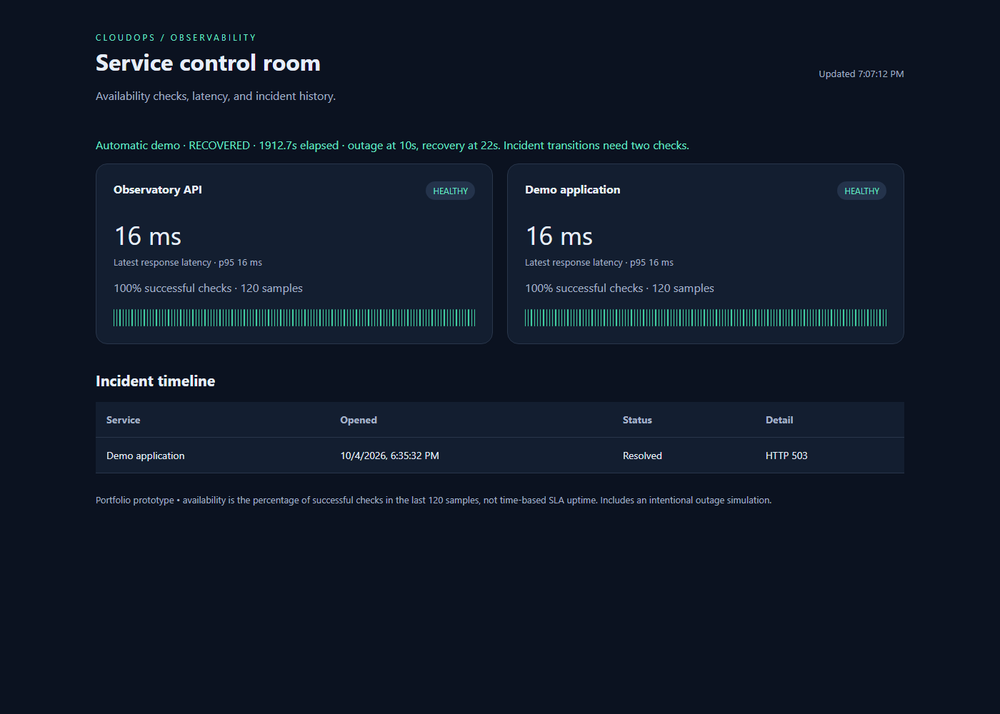

# CloudOps Observatory

A cloud operations portfolio project: monitor HTTP services, inspect response latency, and follow persistent incident history from a dashboard.



## Implemented version 0.4

Start with `py -3 app.py --demo` and open http://127.0.0.1:8080.
The demonstration automatically runs healthy → outage → recovery in about
30 seconds. It uses a separate demo.db file and requires no external service.
See [your first Python lesson](docs/PYTHON_LESSON_01.md) and lesson_01.py.

- Configured HTTP/HTTPS endpoint checks with timeout and expected status.
- Bounded concurrent probes (up to eight workers) and configurable consecutive-failure/recovery thresholds, persisted across restarts.
- SQLite check history and deduplicated incidents, automatically resolved on recovery.
- Dashboard with per-service sample availability, latency, and history.
- JSON status API and a health endpoint.
- Prometheus-compatible metrics and a nearest-rank p95 latency value in the status API.
- An intentional HTTP 503 endpoint for demonstrating outages.
- A timed local demonstration with two-failure/two-success incident thresholds.
- A short standalone Python exercise for checking one HTTP endpoint.
- Integration and state-transition tests, Docker packaging, and a GitHub Actions test workflow.
- A local Kubernetes deployment manifest and manual GHCR publishing workflow, supplied but not executed.

This is a working local prototype, not a production platform. No live cloud deployment, Kubernetes execution, notifications, authentication, Terraform infrastructure, or security audit has been completed. The Docker image, container, and Minikube deployment were validated locally on Windows 11, including non-root execution, health probes, persistent storage, and pod replacement; GitHub Actions tests passed. See docs/DEPLOYMENT_RUNBOOK.md and docs/INTERVIEW_GUIDE.md.

## Start on Windows (PowerShell)

Install Python 3.12 or later if needed. Extract the folder, open PowerShell in it, then:

```powershell
py -3 app.py
```

Open http://127.0.0.1:8080. The API service should become healthy and the outage simulation should show an open incident after two monitoring cycles (roughly 15–30 seconds). Stop with Ctrl+C. If `py` is unavailable, use `python app.py`.

To demonstrate recovery, change the outage simulation URL in `services.json` to `http://127.0.0.1:8080/healthz`, retaining its service name. Restart the app with the same database. Its incident resolves after two successful checks (roughly 15–30 seconds).

```powershell
py -3 -m unittest -v
```

## Docker

```powershell
docker build -t cloudops-observatory .
docker volume create observatory-data
docker run --rm -p 127.0.0.1:8080:8080 -v observatory-data:/data cloudops-observatory
```

Configure only endpoints you own or have permission to monitor. Configuration is read at startup. In Docker, localhost refers to this container; adjust URLs when monitoring other services.

## Architecture and decisions

Browser → read-only HTTP API → SQLite. A background worker probes trusted configured services and writes check results and incident transitions. A failed check opens one incident per service; a successful check resolves it. The demo opens an incident after two consecutive failures and resolves it after two consecutive successes. Every probe result still counts toward sample availability.

The initial version uses Python's standard library so installation is simple. SQLite is adequate for one local process. Probes run concurrently with at most eight worker threads; larger service lists are queued. A cycle completes when its probes finish, so its slowest probe still affects the next cycle start. Availability is calculated over the latest 120 checks, not elapsed time. The worker waits the configured interval after each full cycle.

## Planned advanced releases — not implemented

1. Retention, structured logs, stale-data detection, and richer Prometheus metrics.
2. PostgreSQL, authenticated administration, separate scheduler/workers, and audit records.
3. Notification delivery with retry queues, incident acknowledgement, and maintenance windows.
4. Terraform deployment to AWS, least-privilege IAM, secret management, and budget controls.
5. Kubernetes deployment, readiness/liveness checks, CI image publishing, rollback demonstrations.
6. Load tests, failure-injection experiments, SLO reporting, and an operational runbook.

## Before publishing a live demo

Keep the prototype bound to localhost. Its status API exposes configured endpoint URLs and error details. The standard-library HTTP server is for local demonstration, not public production hosting. Before internet exposure add authentication, a production server/reverse proxy, TLS, SSRF controls (including redirect and DNS handling), credential redaction, rate limits, retention, and operational monitoring. No secrets should be placed in repository configuration.

## Recruiter evidence and interview preparation

Record a short demo showing healthy service → outage → incident → recovery. Include actual test output and a screenshot. Be prepared to explain the incident state machine, timeout handling, sample-based availability, SQLite transactions, Docker networking, and how you would scale the worker.

This first version was created with AI assistance. Review, run, modify, and understand it before describing it on your resume. Claim only features you have verified; do not present planned cloud infrastructure as deployed work.
